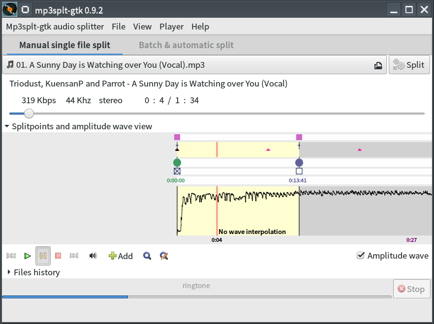

<h1 align="center">
  
   
  Mp3splt
</h1>

<b>This is the snap for Mp3splt</b>, <i>"An utility to split mp3, ogg vorbis and FLAC files without decoding"</i>. It works on Ubuntu, Fedora, Debian, and other major Linux
distributions.

<!-- Uncomment and modify this when you are provided a build status badge

-->

Published for  with 💝 by Snapcrafters

## Installation

    sudo snap install --channel=edge --devmode mp3splt-gtk

([Don't have snapd installed?](https://snapcraft.io/docs/core/install))

## Remaining Tasks

Snapcrafters ([join us](https://forum.snapcraft.io/t/join-snapcrafters/1325)) are working to land snap install documentation and the [snapcraft.yaml](https://github.com/snapcrafters/fork-and-rename-me/blob/master/snap/snapcraft.yaml)
upstream so Mp3splt can authoritatively publish future releases.

  - [x] Fork the [Snapcrafters template](https://github.com/snapcrafters/fork-and-rename-me) repository to your own GitHub account.
    - If you have already forked the Snapcrafter template to your account and want to create another snap, you'll need to use GitHub's [Import repository](https://github.com/new/import) feature because you can only fork a repository once.
  - [x] Rename the forked Snapcrafters template repository
  - [x] Update the description of the repository
  - [x] Update logos and references to `Mp3splt` and `mp3splt`
  - [x] Create a snap that runs in `devmode`
  - [x] Register the snap in the store, **using the preferred upstream name**
  - [x] Add a screenshot to this `README.md`
  - [x] Publish the `devmode` snap in the Snap store edge channel
  - [x] Add install instructions to this `README.md`
  - [x] Update snap store metadata, icons and screenshots
  - [x] Convert the snap to `strict` confinement, or `classic` confinement if it qualifies
  - [ ] Publish the confined snap in the Snap store beta channel
  - [ ] Update the install instructions in this `README.md`
  - [ ] Post a call for testing on the [Snapcraft Forum](https://forum.snapcraft.io) - [link]()
  - [ ] Ask a [Snapcrafters admin](https://github.com/orgs/snapcrafters/people?query=%20role%3Aowner) to fork your repo into github.com/snapcrafters, transfer the snap name from you to snapcrafters, and configure the repo for automatic publishing into edge on commit
  - [ ] Add the provided Snapcraft build badge to this `README.md`
  - [ ] Publish the snap in the Snap store stable channel
  - [ ] Update the install instructions in this `README.md`
  - [ ] Post an announcement in the [Snapcraft Forum](https://forum.snapcraft.io) - [link]()
  - [ ] Submit a pull request or patch upstream that adds snap install documentation - [link]()
  - [ ] Submit a pull request or patch upstream that adds the `snapcraft.yaml` and any required assets/launchers - [link]()
  - [ ] Add upstream contact information to the `README.md`  
  - If upstream accept the PR:
    - [ ] Request upstream create a Snap store account
    - [ ] Contact the Snap Advocacy team to request the snap be transferred to upstream
  - [ ] Ask the Snap Advocacy team to celebrate the snap - [link]()

If you have any questions, [post in the Snapcraft forum](https://forum.snapcraft.io).

## The Snapcrafters

|  |
| :---: |
| [林博仁(Buo-ren, Lin)](https://Lin-Buo-Ren.github.io) |

## Upstream

|  |
| :---: |
| [Alexandru Munteanu](https://sourceforge.net/u/userid-1009175) |

|  |
| :---: |
| [Matteo Trotta](https://sourceforge.net/u/mtrotta) |